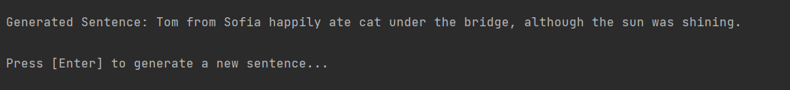
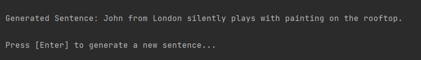
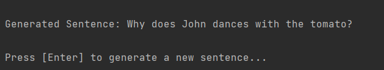
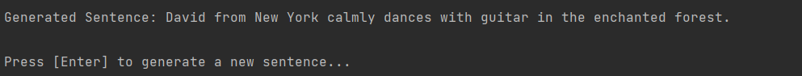

# RandomSentencesGeneratorByIvelinaIvanova

   
  
RandomSentencesGeneratorByIvelinaIvanova is a console-based Java implementation of the "Random Sentences Generator" that generates random sentences based on a predefined sentence model. The goal of this project is to provide a fun and creative way to generate diverse and interesting sentences with different structures. These phrases can add a touch of humour and be a cool way to surprise other by sharing a stand-out sentence on social media platform and gathering your network`s reaction.

## Solution
The solution involves creating arrays for names, places, verbs, nouns, adverbs, and details. The application uses a random word selection method to construct sentences based on various sentence structures, including normal sentences, questions, and complex sentences.

## Technologies Used
- Java
- Random class for randomness

## Source Code
The source code for this project can be found [here](./RandomSentencesGenerator.java).

## Screenshots
*Example of a generated sentence:*

*Another scenarios of the sentences generator in action:*

*Certain grammatical inaccuracies may be present in the generated sentences. Please excuse any grammatical errors in the generated text. While language proficiency is important to me, it wasn't the primary focus during the project's inception.*
